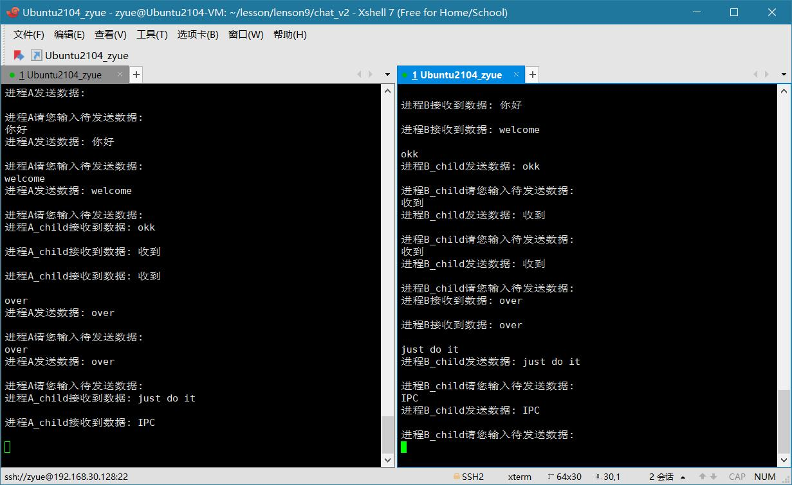

# 使用有名管道实现两个进程间聊天功能(改进)

> 改进后可以连续发送接收消息，不再是一读一写！

- 创建两个进程，进程A和进程B；
- 创建两个有名管道，fifo1和fifo2；
- 进程A再fork一个子进程A_child;
- 进程A使用fifo1的写端；
- 进程A_child使用fifo2的读端；
- 进程B也fork一个子进程B_child;
- 进程B使用fifo1的读端；
- 进程B_child使用fifo2的写端；

## 进程A
1. 以只写权限打开fifo1；
2. 循环的写数据；
```
while (1) {
    键盘输入；
    写fifo1；
}
```
## 进程A_child
1. 以只读权限打开fifo2；
2. 循环的读数据；
```
while (1) {
    读fifo2；
}
```

## 进程B
1. 以只读权限打开fifo1；
2. 循环的读数据；
```
while (1) {
    读fifo1；
}
```
## 进程B_child
1. 以只写权限打开fifo2；
2. 循环的写数据；
```
while (1) {
    键盘输入；
    写fifo2；
}
```
---

 
